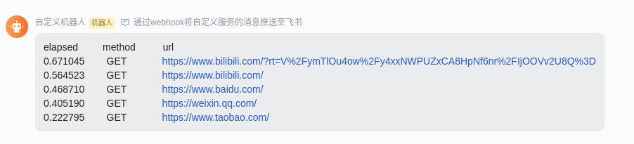

# pytest-requestselapsed
当前插件对 [requests](https://requests.readthedocs.io/en/latest/) 库进行简单的封装使它成为一个 [fixture](https://docs.pytest.org/en/6.2.x/fixture.html) 对象.

&nbsp;  
**安装插件**  
```python3
pip3 install pytest-requestselapsed
```

&nbsp;  
**测试用例**  
[test_case.py](example/readme/test_case.py)  
不需要导入 requests 库, 在测试函数入口声明使用 requests Fixture就具备使用 requests 库的能力.
```python3

def test_baidu(requests):
    resp = requests.get("https://www.baidu.com")
    assert resp.status_code < 400

    
def test_qq(requests):
    resp = requests.get("https://weixin.qq.com/")
    assert resp.status_code < 400

    
def test_taobao(requests):
    resp = requests.get("https://www.taobao.com")
    assert resp.status_code < 400


def test_bilibili(requests):
    resp = requests.get("https://www.bilibili.com")
    assert resp.status_code < 400

```

&nbsp;  
**测试报告**
- 默认表现
    ```shell
    $ cd example/readme/
    $ pytest
    ======================================= test session starts =======================================
    platform linux -- Python 3.8.10, pytest-7.1.2, pluggy-1.0.0
    rootdir: /home/zt/PycharmProjects/pytest-requestselapsed/example/readme
    plugins: requestselapsed-0.0.1
    collected 4 items                                                                                                      
    
    test_case.py ....                                                                            [100%]
    
    ======================================== 4 passed in 1.44s ========================================
    
    ```

- 在控制台打印api响应报告
    ```shell
    $ cd example/readme/
    $ pytest --output-mode=console
    ============================================= test session starts =============================================
    platform linux -- Python 3.8.10, pytest-7.1.2, pluggy-1.0.0
    rootdir: /home/zt/PycharmProjects/pytest-requestselapsed/example/readme
    plugins: requestselapsed-0.0.1
    collected 4 items                                                                                                       
    
    test_case.py ....                                                                                       [100%]
    
    elapsed         method          url
    0.690789        GET             https://www.bilibili.com/?rt=V%2FymTlOu4ow%2Fy4xxNWPUZxCA8HpNf6nrCC8%2BjIwXT0M%3D
    0.572896        GET             https://www.bilibili.com/
    0.498390        GET             https://www.baidu.com/
    0.387840        GET             https://weixin.qq.com/
    0.159209        GET             https://www.taobao.com/
    
    ============================================== 4 passed in 1.58s ==============================================
    ```

- 在飞书群聊窗口打印api响应报告
  ```
    $ cd example/readme/
    $ pytest --output-mode=feishu --feishu-webhook-url=https://open.feishu.cn/open-apis/bot/v2/hook/xxxxxxxx-xxxx-xxxx-xxxx-xxxxxxxxxxxx
    ======================================= test session starts =======================================
    platform linux -- Python 3.8.10, pytest-7.1.2, pluggy-1.0.0
    rootdir: /home/zt/PycharmProjects/pytest-requestselapsed/example/readme
    plugins: requestselapsed-0.0.1
    collected 4 items                                                                                                      
    
    test_case.py ....                                                                            [100%]
    
    ======================================== 4 passed in 1.44s ========================================  
  ```
  

&nbsp;  
**更多案例**    

- [参考这里](https://github.com/zhengtong0898/pytest-requestselapsed/tree/main/example)
